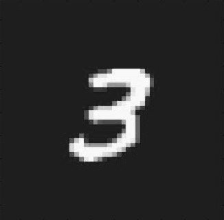

# 🧠 MNIST Digit Classifier

Ce projet est une application de reconnaissance des chiffres manuscrits utilisant un modèle CNN entraîné sur la base de données MNIST.  
Elle permet de prédire le chiffre présent dans une image que l'utilisateur peut télécharger.

---

## 📌 Objectifs

- Entraîner un modèle de Deep Learning avec TensorFlow/Keras.
- Utiliser des images personnalisées (par exemple, écriture manuelle réelle).
- Créer une interface Web interactive avec **Streamlit**.
- Déployer localement ou sur le Web (par exemple : Streamlit Cloud).

---

## 🧰 Technologies utilisées

- Python 3.10+
- TensorFlow / Keras
- NumPy
- OpenCV
- Pillow
- Streamlit

---

## 📁 Structure du projet

```
mnist-digit-classifier/
├── app.py                      # Application Streamlit
├── models/
│   └── mnist_model.keras       # Modèle entraîné
├── samples/
│   └── my_digit_3.png          # Exemples d'images personnalisées
├── src/
│   ├── train_cnn.py            # Entraînement du modèle
│   └── predict_custom_image.py # Prédiction à partir d'image locale
├── requirements.txt            # Dépendances Python
└── README.md
```

---

## ⚙️ Installation

1. **Cloner le projet :**
```bash
git clone https://github.com/votre-utilisateur/mnist-digit-classifier.git
cd mnist-digit-classifier
```

2. **Créer un environnement virtuel (recommandé) :**
```bash
python -m venv venv
source venv/bin/activate  # Linux/macOS
venv\Scriptsctivate     # Windows
```

3. **Installer les dépendances :**
```bash
pip install -r requirements.txt
```

---

## 🚀 Lancer l'application

```bash
streamlit run app.py
```

Ouvrez le lien local qui s'affiche (souvent http://localhost:8501).

---

## 📷 Exemple d'utilisation

1. Téléversez une image d'un chiffre manuscrit (format PNG ou JPG).
2. Le modèle prédit le chiffre correspondant.
3. Vous verrez la prédiction directement sur l'écran.

---

## ✍️ Exemple d'image personnalisée



---

## 📚 À venir

- Interface pour dessiner directement le chiffre à la main.
- Amélioration du prétraitement d'image (centrage, contraste).
- Ajout des probabilités complètes pour chaque chiffre (0 à 9).
- Déploiement en ligne via **Streamlit Cloud** ou **Hugging Face Spaces**.

---

## 🧑‍💻 Développé par

**Badr**
Passionné par l'IA, les systèmes intelligents et le développement Full Stack.
📍 Maroc

---

## 📜 Licence

Ce projet est sous licence MIT.
